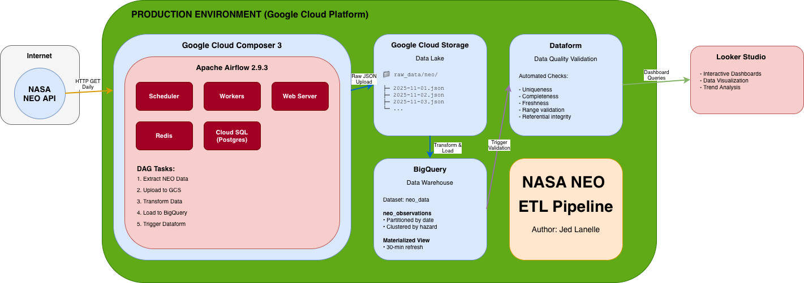

# NASA NEO ETL Pipeline

[](https://airflow.apache.org/)
[](https://www.python.org/)
[](https://cloud.google.com/bigquery)
[](https://cloud.google.com/storage)
[](https://cloud.google.com/composer)
[](https://pandas.pydata.org/)
[](https://www.docker.com/)
[](https://api.nasa.gov/)

A production-ready ETL pipeline that extracts Near Earth Object (NEO) data from NASA's API, stores raw data in Google Cloud Storage (GCS), and loads it into BigQuery with optimized partitioning and clustering for cost efficiency and performance. **Successfully migrated to and running on Google Cloud Composer 3** with enterprise-grade optimizations.

## 🚀 Project Overview

This pipeline fetches daily asteroid observation data from NASA's NEO API and processes it into a structured, optimized BigQuery table. It implements modern data engineering best practices including incremental loading, data partitioning, and clustering strategies.

### Key Features

- **Production Deployment**: Running on Google Cloud Composer 3 in `asia-southeast2` region
- **Secure Secrets Management**: NASA API keys stored in Google Secret Manager (no hardcoded credentials)
- **Cloud-Native Architecture**: Fully leverages GCP services with optimized Airflow providers
- **Daily Incremental Loading**: Processes only new data for each execution date
- **GCS Data Lake**: Raw JSON files stored in Google Cloud Storage for data lineage and reprocessing
- **Cost-Optimized Storage**: BigQuery table partitioned by observation date and clustered by hazard status
- **Comprehensive Data Quality**: Dataform (GCP) assertions with 5-stage quality validation
- **Real-time Analytics**: Materialized view with 30-minute refresh for dashboard queries
- **Containerized Deployment**: Docker-based Airflow environment for local development
- **Scalable Architecture**: Modular design with separate extract, transform, and load phases

### Benefits of GCS Integration

The addition of Google Cloud Storage as a data lake provides several key advantages:

1. **Data Lineage**: Complete audit trail with raw API responses stored as dated JSON files
2. **Reprocessability**: Ability to reprocess historical data without re-calling NASA API (avoiding rate limits)
3. **Cost Efficiency**: GCS storage is cheaper than API calls for historical data retrieval
4. **Debugging**: Easy inspection of raw data when troubleshooting transformation issues
5. **Compliance**: Immutable raw data storage for regulatory requirements
6. **Disaster Recovery**: Complete data backup independent of BigQuery

## 🏗️ Architecture


### Data Flow
1. **Extract**: Fetch NEO data from NASA API for specific date range
2. **Store Raw Data**: Upload JSON to GCS bucket (`gs://neo-nasa-data-nasa-neo-pipeline/raw_data/neo/neo_raw/YYYY-MM-DD.json`)
3. **Transform**: Download from GCS, parse JSON, flatten nested structures
4. **Load**: Insert into partitioned BigQuery table with clustering for optimal query performance
5. **Quality Assurance**: Dataform assertions validate data quality with 5-stage checks
6. **Analytics**: Auto-refreshing materialized view for dashboard consumption

## 📊 Data Schema

The pipeline creates a BigQuery table with the following structure:

| Field | Type | Description |
|-------|------|-------------|
| `neo_id` | STRING | Unique identifier for the Near Earth Object |
| `observation_date` | DATE | Date of observation (partition key) |
| `is_potentially_hazardous` | BOOLEAN | Hazard classification (cluster key) |
| `miss_distance_km` | FLOAT | Distance from Earth in kilometers |
| `relative_velocity_kmh` | FLOAT | Relative velocity in km/h |
| `estimated_diameter_*` | FLOAT | Size estimations in meters |
| `ingestion_timestamp` | TIMESTAMP | Pipeline execution timestamp |

**Optimization Strategy:**
- **Partitioned by**: `observation_date` (daily partitions)
- **Clustered by**: `is_potentially_hazardous`, `is_sentry_object`, `orbiting_body`
- **Benefits**: ~80% cost reduction for date-filtered queries, faster hazard analysis

## 🛠️ Technology Stack

- **Orchestration**: Google Cloud Composer 3 (Airflow 2.9.3) - Production | Apache Airflow 2.7.3 - Local Dev
- **Cloud Platform**: Google Cloud Platform
- **Secrets Management**: Google Secret Manager (secure API key storage)
- **Data Lake**: Google Cloud Storage (GCS)
- **Data Warehouse**: BigQuery (partitioned & clustered tables)
- **Data Quality**: Dataform (GCP) - Automated quality assertions
- **Language**: Python 3.x
- **Containerization**: Docker & Docker Compose (local development)
- **Data Processing**: Pandas, PyArrow
- **Airflow Providers**: `apache-airflow-providers-google==10.11.0`

## ✨ Cloud Composer 3 Optimizations

This pipeline has been successfully migrated to **Google Cloud Composer 3** with the following production-grade optimizations:

### Dual Environment Architecture
- **Single DAG for Both Environments**: Same code runs on Cloud Composer 3 (production) and local Docker (development)
- **Automatic Environment Detection**: Detects runtime environment via `COMPOSER_ENVIRONMENT` variable
- **Smart Fallback Mechanisms**: Gracefully handles missing Cloud Composer-specific packages in local dev
- **Zero Configuration Switching**: No code changes needed when deploying between environments

### Security Enhancements
- **Google Secret Manager Integration**: NASA API keys stored securely in Secret Manager (Cloud Composer)
- **Airflow Connections Fallback**: Automatically uses Airflow Connections in local development
- **No Hardcoded Credentials**: All sensitive data managed appropriately for each environment
- **IAM-Based Access Control**: Service accounts with least-privilege permissions (Cloud Composer)

### Performance Improvements
- **Native GCP Operators**: Uses `GCSHook`, `BigQueryHook`, and `GoogleCloudSecretManagerHook` for optimal performance
- **Dataform Integration**: Native Dataform operators (`DataformCreateCompilationResultOperator`, `DataformCreateWorkflowInvocationOperator`)
- **Optimized Task Dependencies**: Parallel execution where possible, sequential where necessary
- **Efficient Data Transfer**: Direct GCS-to-BigQuery loading without intermediate storage

### Cloud-Native Architecture
- **Tags for Monitoring**: DAG tagged with `['composer3', 'gcs', 'secrets-manager', 'incremental']` for easy filtering
- **Regional Deployment**: All resources in `asia-southeast2` for reduced latency
- **Catchup Enabled**: Historical backfill capability for reprocessing past dates
- **Max Active Runs**: Set to 1 to prevent overlapping executions and data conflicts

### Migration Status
- **Status**: Production-ready and actively running
- **Region**: `asia-southeast2`
- **Composer Version**: Cloud Composer 3 (Airflow 2.9.3)
- **Schedule**: Daily at midnight UTC (`@daily`)
- **Monitored**: Integrated with Cloud Logging and Dataform quality checks

## 📋 Prerequisites

### For Local Development:
1. **GCP Account** with BigQuery API and Cloud Storage enabled
2. **GCS Bucket**: Create bucket `neo-nasa-data-nasa-neo-pipeline` (or update bucket name in DAG)
3. **NASA API Key** (free from https://api.nasa.gov/)
4. **Docker & Docker Compose** installed
5. **GCP Service Account** with the following permissions:
   - BigQuery Data Editor
   - BigQuery Job User
   - Storage Object Admin
6. **GCP Authentication**: Run `gcloud auth application-default login`

### For Cloud Composer 3:
1. **Cloud Composer 3 Environment** in region `asia-southeast2`
2. **GCS Bucket**: `neo-nasa-data-nasa-neo-pipeline`
3. **BigQuery Dataset**: `neo_data` in project `nasa-neo-pipeline`
4. **Dataform Repository**: `nasa-neo-dataform` in region `asia-southeast2`
5. **Airflow Connections**: Configured in Composer (see below)

## 🚀 Quick Start

### Local Development Setup

**Dual Environment Support**: This DAG is designed to work seamlessly in both local Docker and Cloud Composer 3 environments:
- **API Key Management**: Automatically uses Secret Manager (Cloud Composer) or Airflow Connections (Local Dev)
- **Dataform Quality Checks**: Included in both environments (may fail gracefully locally if repository not set up)
- **No Code Changes Required**: Same DAG file works in both environments

#### 1. Clone and Setup
```bash
git clone <your-repo>
cd nasa_neo_pipeline
```

#### 2. Create GCS Bucket
```bash
# Authenticate with GCP
gcloud auth login
gcloud config set project nasa-neo-pipeline

# Create GCS bucket for raw data
gsutil mb -l asia-southeast2 gs://neo-nasa-data-nasa-neo-pipeline

# Create BigQuery dataset
bq mk --location=asia-southeast2 neo_data
```

#### 3. Configure Credentials
```bash
# Place your GCP service account key
cp /path/to/your/service-account.json config/gcp-service-account.json

# Authenticate for local development
gcloud auth application-default login

# Set environment variables (create .env file)
echo "GOOGLE_APPLICATION_CREDENTIALS=/opt/airflow/config/gcp-service-account.json" > .env
```

#### 4. Launch Airflow
```bash
# Initialize Airflow database and start services
docker compose up airflow-init
docker compose up -d

# Check services are running
docker compose ps
```

#### 5. Configure Connections
Access Airflow UI at `http://localhost:8080` (airflow/airflow) and set up:

**NASA API Connection:**
- Connection ID: `nasa_api`
- Connection Type: HTTP
- Host: `https://api.nasa.gov`
- Extra: `{"api_key": "YOUR_NASA_API_KEY"}`

**GCP Connection:**
- Connection ID: `google_cloud_default`
- Connection Type: Google Cloud
- Project ID: `your-gcp-project-id`
- Keyfile Path: `/opt/airflow/config/gcp-service-account.json`

#### 6. Run Pipeline
- Navigate to DAGs in Airflow UI
- Enable `dag_ingest_neo_nasa_api_bigquery`
- Trigger manual run or wait for scheduled execution

**Important Notes for Local Development:**

1. **Environment Detection**: The DAG automatically detects whether it's running locally or on Cloud Composer
   - Detection method: Checks for `COMPOSER_ENVIRONMENT` environment variable
   - Local: Uses Airflow Connections for API keys
   - Cloud Composer: Uses Google Secret Manager for API keys

2. **Dataform Quality Checks**:
   - The DAG includes Dataform quality assertion tasks in both environments
   - In Cloud Composer 3: Tasks run successfully with your Dataform repository
   - In Local Dev: Tasks will attempt to run but may fail if Dataform repository is not accessible
   - The ETL pipeline completes successfully regardless; Dataform tasks are for quality validation only

3. **Required Connections** (already configured if you used local Airflow before):
   - `nasa_api`: HTTP connection with your NASA API key in the Extra field
   - `google_cloud_default`: GCP connection with service account credentials

---

### Cloud Composer 3 Deployment

**Current Status**: Successfully deployed and running in production!

The pipeline is currently deployed on Cloud Composer 3. Below are the deployment steps for reference or redeployment:

#### 1. Create Cloud Composer 3 Environment
```bash
gcloud composer environments create nasa-neo-pipeline \
    --location asia-southeast2 \
    --image-version composer-3-airflow-2.9.3 \
    --environment-size small \
    --project nasa-neo-pipeline
```

#### 2. Install Python Dependencies
```bash
# Upload requirements.txt to Composer
gcloud composer environments update nasa-neo-pipeline \
    --location asia-southeast2 \
    --update-pypi-packages-from-file requirements.txt
```

#### 3. Configure Secrets in Google Secret Manager

**Production Setup**: NASA API keys are now stored securely in Google Secret Manager:

```bash
# Store NASA API key in Secret Manager
echo -n "YOUR_NASA_API_KEY" | gcloud secrets create nasa-api-key \
    --project=nasa-neo-pipeline \
    --replication-policy="automatic" \
    --data-file=-

# Grant Composer service account access to the secret
gcloud secrets add-iam-policy-binding nasa-api-key \
    --project=nasa-neo-pipeline \
    --member="serviceAccount:COMPOSER_SERVICE_ACCOUNT@nasa-neo-pipeline.iam.gserviceaccount.com" \
    --role="roles/secretmanager.secretAccessor"
```

**Note**: The DAG now retrieves API keys directly from Secret Manager using `GoogleCloudSecretManagerHook`, eliminating the need for Airflow Connections for API keys.

#### 4. Upload DAG Files
```bash
# Get the DAGs bucket
DAGS_BUCKET=$(gcloud composer environments describe nasa-neo-pipeline \
    --location asia-southeast2 \
    --format="get(config.dagGcsPrefix)")

# Upload DAG files
gsutil -m cp -r dags/* ${DAGS_BUCKET}/
gsutil -m cp -r config ${DAGS_BUCKET}/
```

#### 5. Verify Deployment
- ✅ Composer Airflow UI accessible from GCP Console
- ✅ DAG `dag_ingest_neo_nasa_api_bigquery` visible and active
- ✅ Secret Manager integration verified
- ✅ Daily scheduled runs executing successfully

#### 6. Monitor Production Pipeline
- **Airflow UI**: Monitor task execution and logs in Cloud Composer 3 UI
- **Cloud Logging**: View detailed execution logs with filtering by DAG tags
- **BigQuery Console**: Verify data loads in `nasa-neo-pipeline.neo_data.neo_observations`
- **GCS Console**: Check raw data files in `gs://neo-nasa-data-nasa-neo-pipeline/raw_data/neo/neo_raw/`
- **Dataform**: Monitor data quality assertions in `nasa-neo-dataform` repository
- **Secret Manager**: Audit API key access and rotation

## 📁 Project Structure

```
nasa_neo_pipeline/
├── dags/
│   ├── etl_pipeline/
│   │   └── nasa_neo_etl.py          # Main ETL DAG with GCS integration
│   └── scripts/
│       └── create_neo_table.py      # BigQuery table creation utility
├── config/
│   ├── gcp-service-account.json     # GCP credentials (local only)
│   └── neo_schema.json              # BigQuery schema definition
├── sql/
│   └── create_mv.sql                # Materialized view for analytics
├── data/
│   └── neo_nasa_data_sample.json    # Sample API response
├── logs/                            # Airflow execution logs
├── docker-compose.yaml              # Airflow cluster setup (local)
├── Dockerfile                       # Custom Airflow image
├── requirements.txt                 # Python dependencies
└── README.md                        # This file
```

### GCS Data Structure
```
gs://neo-nasa-data-nasa-neo-pipeline/
└── raw_data/
    └── neo/
        └── neo_raw/
            ├── 2025-10-01.json      # Daily raw JSON files
            ├── 2025-10-02.json
            └── ...
```

## 🔧 Configuration

### Airflow Variables
Set these in Airflow UI → Admin → Variables:

| Variable | Value | Description |
|----------|-------|-------------|
| `daily_dag_run` | `@daily` | Schedule interval for the pipeline |

### BigQuery Optimization Settings
- **Partition Expiration**: Configurable in `create_neo_table.py`
- **Clustering Fields**: Optimized for hazard analysis queries
- **Partition Filter**: Required to prevent accidental full table scans

## 📈 Monitoring & Observability

### Airflow Monitoring
- **Web UI**: http://localhost:8080
- **Task Logs**: Detailed execution logs for each task

### Dataform Data Quality Monitoring
- **GCP Console**: Monitor assertion results and validation status
- **Automated Checks**: 5-stage quality validation runs after each data load
- **Assertion Reports**: View detailed pass/fail results for each quality check

### BigQuery Monitoring
```sql
-- Check daily data volumes
SELECT 
  observation_date,
  COUNT(*) as record_count,
  COUNT(DISTINCT neo_id) as unique_neos,
  SUM(CASE WHEN is_potentially_hazardous THEN 1 ELSE 0 END) as hazardous_count
FROM `your-project.neo_data.neo_observations`
WHERE observation_date >= CURRENT_DATE - 7
GROUP BY observation_date
ORDER BY observation_date DESC;
```

## 🔍 Data Quality & Analytics

### Automated Data Quality Checks (Dataform)
Data quality is managed through **Dataform (GCP)** assertions that run comprehensive 5-stage validation after each load:

1. **Required Fields Completeness**: Validates critical fields (neo_id, observation_date, absolute_magnitude_h) are not null
2. **Numeric Validation**: Ensures no negative values in physical measurements
3. **Diameter Logic**: Validates min_diameter ≤ max_diameter relationships
4. **Duplicate Detection**: Identifies duplicate NEO records for the same observation date
5. **Load Verification**: Confirms data was successfully loaded for the execution date

**Implementation**: Quality checks are defined as Dataform assertions using the same validation logic as the previous implementation, now integrated with GCP's native data quality framework for better observability and monitoring.

### Materialized View for Analytics
**Table**: `neo_data.neo_daily_summary_mv`
- **Refresh**: Every 30 minutes automatically
- **Partitioned by**: observation_date
- **Purpose**: Optimized for dashboard queries and reporting

**Key Metrics Provided**:
- Daily observation counts and unique NEO counts
- Hazardous vs non-hazardous object statistics
- Sentry object monitoring
- Distance metrics (closest/farthest/average approaches)
- Size distribution (diameter statistics)
- Velocity analysis
- Orbiting body distribution

### Interactive Dashboard
📊 **[NEO Analytics Dashboard](https://lookerstudio.google.com/reporting/5ba0a491-f394-40f6-9092-ff899d8cb10c)**

Real-time visualization of NEO data trends, hazard analysis, and observation statistics powered by the materialized view.

## 💰 Cost Optimization

### GCS Storage Benefits
- **Raw Data Lake**: Stores raw JSON files in GCS for data lineage and reprocessing
- **Storage Classes**: Use Standard storage for frequently accessed data, Archive for long-term retention
- **Data Retention**: Implement lifecycle policies to archive old raw files
- **Reprocessing Capability**: Can rebuild BigQuery tables from GCS without re-calling NASA API

### BigQuery Costs
- **Partitioning**: Reduces scan costs by ~80% for date-filtered queries
- **Clustering**: Improves query performance for hazard analysis
- **Data Types**: Optimized field types reduce storage costs
- **Incremental Loading**: Delete-and-insert pattern ensures no duplicate costs

### Example Query Optimization
```sql
-- Efficient query (uses partition pruning)
SELECT * FROM neo_observations
WHERE observation_date = '2025-10-28'
  AND is_potentially_hazardous = true;

-- Cost: ~$0.001 vs $0.05 for full table scan
```

### Storage Cost Estimation
- **GCS**: ~$0.02/GB/month (Standard storage)
- **BigQuery**: ~$0.02/GB/month (active storage)
- **Daily Data**: ~1-5 MB raw JSON per day
- **Monthly Cost**: < $1 for both GCS and BigQuery storage

## 🔄 Pipeline Schedule

- **Frequency**: Daily at midnight UTC
- **Incremental**: Only processes new data for execution date
- **Catchup**: Enabled for backfilling historical data
- **Concurrency**: Single active run to prevent conflicts

## 🚨 Troubleshooting

### Common Issues

1. **DAG Import Error - GoogleCloudSecretManagerHook**
   ```
   ImportError: cannot import name 'GoogleCloudSecretManagerHook'
   ```
   - **Solution**: This is expected in older Airflow versions. The DAG now has conditional imports
   - The DAG will automatically fall back to using Airflow Connections for local development
   - Update the DAG file if you modified it manually

2. **Docker Compose Version Warning**
   ```
   the attribute `version` is obsolete
   ```
   - **Solution**: This is just a warning and can be ignored
   - The `version` field has been removed from docker-compose.yaml

3. **Docker Compose Won't Start After Update**
   - **Solution**: Clean up old containers and rebuild
   ```bash
   docker compose down -v
   docker compose build
   docker compose up -d
   ```

4. **GCS Upload/Download Errors**
   ```bash
   # Check GCS bucket exists
   gsutil ls gs://neo-nasa-data-nasa-neo-pipeline/

   # Verify permissions
   gsutil iam get gs://neo-nasa-data-nasa-neo-pipeline/

   # Test upload manually
   echo "test" | gsutil cp - gs://neo-nasa-data-nasa-neo-pipeline/test.txt
   ```

2. **API Rate Limits**
   ```bash
   # Check NASA API quota
   curl "https://api.nasa.gov/neo/rest/v1/feed?start_date=2025-10-28&end_date=2025-10-28&api_key=YOUR_KEY"
   ```

3. **BigQuery Permissions**
   ```bash
   # Verify service account permissions
   gcloud auth activate-service-account --key-file=config/gcp-service-account.json
   bq ls your-project:neo_data
   ```

4. **Docker Issues**
   ```bash
   # Reset environment
   docker-compose down -v
   docker-compose up airflow-init
   ```

5. **GCS Path Not Found in load_to_bigquery**
   - Check that `extract_neo_data` task completed successfully
   - Verify XCom is passing the `gcs_path` correctly
   - Check Airflow logs for GCS upload confirmation

6. **Cloud Composer 3 Specific Issues**
   ```bash
   # Check Composer environment status
   gcloud composer environments describe nasa-neo-pipeline --location asia-southeast2

   # View Composer logs
   gcloud composer environments run nasa-neo-pipeline \
       --location asia-southeast2 logs -- -f
   ```

## 🎯 Recent Enhancements & Future Roadmap

### ✅ Recently Completed
- ✅ **Cloud Composer 3 Migration**: Successfully deployed to production environment
- ✅ **Dual Environment Support**: Same DAG works in both Cloud Composer 3 and local Docker without modifications
- ✅ **Smart Environment Detection**: Automatic detection and adaptation to local vs cloud environments
- ✅ **Secret Manager Integration**: Secure API key management for Cloud Composer (with fallback to Airflow Connections locally)
- ✅ **Dataform Quality Checks**: Automated 5-stage data quality validation in both environments
- ✅ **Native GCP Operators**: Optimized for Cloud Composer 3 performance
- ✅ **Conditional Imports**: Graceful handling of Cloud Composer-specific packages in local development

### 🔜 Future Enhancements
- [ ] **GCS Lifecycle Policies**: Automatic archiving of old raw JSON files to Coldline/Archive storage
- [ ] **Real-time Streaming**: Kafka-based real-time ingestion
- [ ] **Alerting**: Slack/Email notifications for pipeline and data quality failures
- [ ] **ML Integration**: Hazard prediction models using BigQuery ML
- [ ] **Multi-cloud**: AWS/Azure deployment options
- [ ] **Advanced Data Quality**: Expand Dataform assertions with statistical anomaly detection
- [ ] **Data Versioning**: Implement versioning for raw data files in GCS
- [ ] **Incremental Backfill**: Utility to reprocess historical data from GCS
- [ ] **Secret Rotation**: Automated NASA API key rotation with Secret Manager

## 📝 Development

### Adding New Data Sources
1. Create new extraction task in `nasa_neo_etl.py`
2. Update schema in `config/neo_schema.json`
3. Modify transformation logic for new fields

### Testing
```bash
# Run individual tasks
docker-compose exec airflow-worker airflow tasks test dag_ingest_neo_nasa_api_bigquery validate_nasa_api_connection 2025-10-28
```

## 📄 License

This project is licensed under the MIT License - see the [LICENSE](LICENSE) file for details.

## 🔗 Resources

- [NASA NEO API Documentation](https://api.nasa.gov/api.html#neows)
- [BigQuery Partitioning Guide](https://cloud.google.com/bigquery/docs/partitioned-tables)
- [Google Cloud Storage Documentation](https://cloud.google.com/storage/docs)
- [Cloud Composer 3 Guide](https://cloud.google.com/composer/docs/composer-3/composer-overview)
- [Airflow Best Practices](https://airflow.apache.org/docs/apache-airflow/stable/best-practices.html)
- [Docker Compose for Airflow](https://airflow.apache.org/docs/apache-airflow/stable/howto/docker-compose/index.html)
- [Airflow GCS Operators](https://airflow.apache.org/docs/apache-airflow-providers-google/stable/operators/cloud/gcs.html)

---

**Author**: Jed Lanelle \
**Project**: NASA NEO ETL Pipeline \
**Status**: Production - Deployed on Cloud Composer 3 \
**Last Updated**: November 2, 2025 \
**Deployment**: `nasa-neo-pipeline` (asia-southeast2)